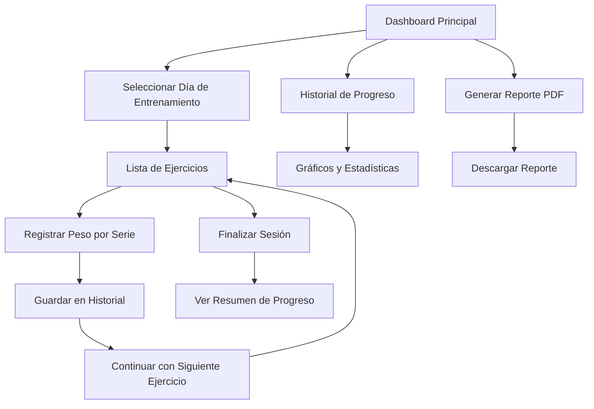

# Gym Tracker - Mejoras de Seguimiento de Peso y Reportes

## 1. Resumen del Proyecto

Mejora de la aplicación Gym Tracker existente para incluir seguimiento de peso, historial de progreso y generación de reportes PDF. La aplicación actualmente permite crear días de entrenamiento, ejercicios con series y repeticiones. Las nuevas funcionalidades incluyen:

- Registro y seguimiento de peso por ejercicio y sesión
- Historial de progreso con visualización de datos
- Generación de reportes PDF mensuales con estadísticas y gráficos de progreso
- Mejoras de UI/UX para una mejor experiencia de usuario

## 2. Funcionalidades Principales

### 2.1 Roles de Usuario
| Rol | Método de Registro | Permisos Principales |
|-----|-------------------|---------------------|
| Usuario Registrado | Email + contraseña | Crear rutinas, registrar peso, ver progreso, generar reportes |

### 2.2 Módulos de Funcionalidad

Nuestra aplicación mejorada consistirá en las siguientes páginas principales:

1. **Dashboard Principal**: navegación, resumen de rutinas, acceso rápido a funciones
2. **Gestión de Rutinas**: crear/editar días de entrenamiento y ejercicios
3. **Registro de Peso**: interfaz para registrar peso por ejercicio y sesión
4. **Historial de Progreso**: visualización de datos históricos con gráficos
5. **Generador de Reportes**: creación y descarga de reportes PDF mensuales
6. **Perfil de Usuario**: configuración de cuenta y preferencias

### 2.3 Detalles de Páginas

| Nombre de Página | Nombre del Módulo | Descripción de Funcionalidad |
|------------------|-------------------|------------------------------|
| Dashboard Principal | Panel de Control | Mostrar resumen de rutinas activas, progreso reciente, accesos rápidos |
| Dashboard Principal | Navegación | Menú principal con acceso a todas las funciones |
| Gestión de Rutinas | Lista de Días | Crear, editar, eliminar días de entrenamiento |
| Gestión de Rutinas | Gestión de Ejercicios | Agregar, modificar, eliminar ejercicios con series y repeticiones |
| Registro de Peso | Formulario de Peso | Registrar peso actual para cada ejercicio en la sesión |
| Registro de Peso | Historial Rápido | Mostrar últimos pesos registrados para referencia |
| Historial de Progreso | Gráficos de Progreso | Visualizar progreso de peso y repeticiones por ejercicio |
| Historial de Progreso | Filtros y Búsqueda | Filtrar por ejercicio, fecha, rango de tiempo |
| Generador de Reportes | Configuración de Reporte | Seleccionar período, ejercicios, tipo de estadísticas |
| Generador de Reportes | Generación PDF | Crear y descargar reporte PDF con gráficos y estadísticas |
| Perfil de Usuario | Configuración | Editar información personal, preferencias de la app |

## 3. Flujo Principal de Procesos

**Flujo de Usuario Registrado:**

1. Usuario inicia sesión y accede al dashboard
2. Selecciona día de entrenamiento actual
3. Para cada ejercicio:
   - Ve series y repeticiones programadas
   - Registra peso utilizado para cada serie
   - Sistema guarda automáticamente en historial
4. Al finalizar sesión, puede ver resumen de progreso
5. Mensualmente, genera reporte PDF con estadísticas
6. Puede consultar historial y gráficos de progreso en cualquier momento

## 4. Diseño de Interfaz de Usuario

### 4.1 Estilo de Diseño

- **Colores Primarios**: Azul (#3B82F6) para acciones principales, Verde (#10B981) para confirmaciones
- **Colores Secundarios**: Gris (#6B7280) para texto secundario, Rojo (#EF4444) para eliminaciones
- **Estilo de Botones**: Redondeados con sombras sutiles, efectos hover suaves
- **Tipografía**: Inter como fuente principal, tamaños 14px-24px
- **Estilo de Layout**: Diseño de tarjetas con espaciado generoso, navegación superior
- **Iconos**: Lucide React para consistencia, tamaño 16px-24px

### 4.2 Resumen de Diseño de Páginas

| Nombre de Página | Nombre del Módulo | Elementos de UI |
|------------------|-------------------|----------------|
| Dashboard Principal | Panel de Control | Tarjetas con métricas, gráficos pequeños, colores azul/verde, tipografía Inter 16px |
| Registro de Peso | Formulario de Peso | Inputs numéricos grandes, botones de incremento/decremento, validación en tiempo real |
| Historial de Progreso | Gráficos | Charts.js con colores consistentes, tooltips informativos, filtros desplegables |
| Generador de Reportes | Configuración | Selectores de fecha, checkboxes para ejercicios, preview del reporte |

### 4.3 Responsividad

La aplicación será mobile-first con adaptación completa para desktop. Optimización táctil para dispositivos móviles con botones de tamaño adecuado y gestos intuitivos.

## 5. Consideraciones Técnicas

### 5.1 Base de Datos

La tabla `progress_history` ya existe con la estructura necesaria:
- `exercise_id`: Referencia al ejercicio
- `weight`: Peso registrado (DECIMAL)
- `notes`: Notas opcionales
- `created_at`: Timestamp del registro

### 5.2 Nuevas Funcionalidades Requeridas

1. **Componente de Registro de Peso**: Input numérico con validación
2. **Sistema de Gráficos**: Integración con Chart.js o similar
3. **Generador de PDF**: Implementación con jsPDF o Puppeteer
4. **Gestión de Estado**: Zustand para manejo de datos de progreso
5. **Validación**: Zod schemas para datos de peso y reportes

### 5.3 Mejoras de Performance

- Lazy loading para gráficos y reportes
- Caching de datos de progreso frecuentemente consultados
- Optimización de consultas a base de datos con índices apropiados
- Compresión de imágenes en reportes PDF