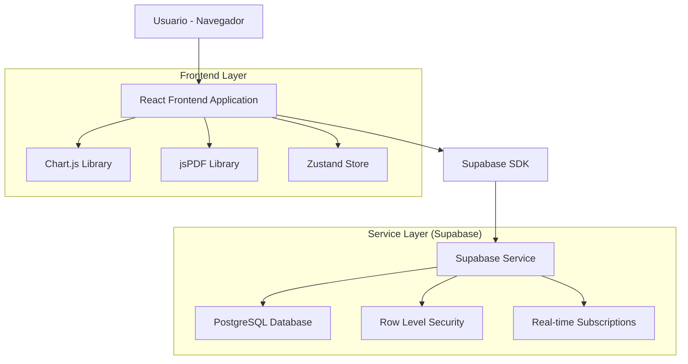
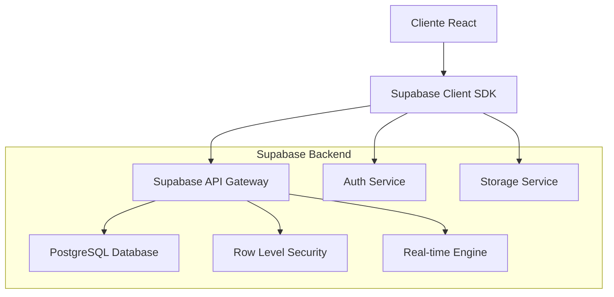
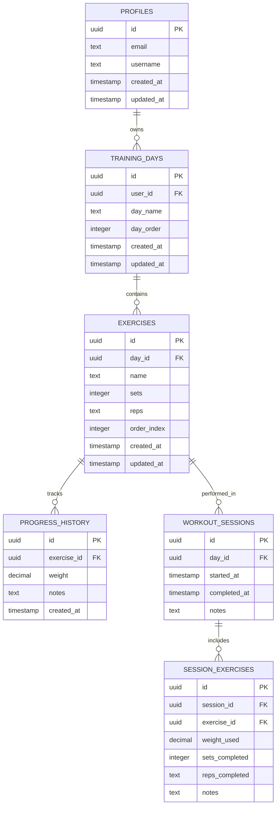

# Arquitectura Técnica - Seguimiento de Peso y Reportes

## 1. Diseño de Arquitectura



## 2. Descripción de Tecnologías

- **Frontend**: React@18 + TypeScript + Tailwind CSS@3 + Next.js@14
- **Backend**: Supabase (PostgreSQL + Auth + Real-time)
- **Gráficos**: Chart.js@4 + react-chartjs-2
- **PDF**: jsPDF@2 + html2canvas (para gráficos)
- **Estado**: Zustand@4 para gestión de estado local
- **Validación**: Zod@3 para schemas de datos
- **Iconos**: Lucide React

## 3. Definiciones de Rutas

| Ruta | Propósito |
|------|----------|
| /dashboard | Dashboard principal con resumen de rutinas y progreso |
| /dashboard/workout/[dayId] | Página de entrenamiento con registro de peso |
| /dashboard/progress | Historial de progreso con gráficos |
| /dashboard/progress/[exerciseId] | Detalle de progreso por ejercicio específico |
| /dashboard/reports | Generador y gestión de reportes PDF |
| /dashboard/profile | Configuración de perfil de usuario |

## 4. Definiciones de API

### 4.1 APIs Core de Supabase

**Registro de Peso**
```typescript
// Crear nuevo registro de peso
supabase
  .from('progress_history')
  .insert({
    exercise_id: string,
    weight: number,
    notes?: string
  })
```

**Consulta de Progreso**
```typescript
// Obtener historial de progreso por ejercicio
supabase
  .from('progress_history')
  .select(`
    id,
    weight,
    notes,
    created_at,
    exercises (
      id,
      name,
      sets,
      reps
    )
  `)
  .eq('exercise_id', exerciseId)
  .order('created_at', { ascending: false })
```

### 4.2 Tipos TypeScript

```typescript
// Tipos para el sistema de peso
export interface WeightEntry {
  id: string;
  exercise_id: string;
  weight: number;
  notes?: string;
  created_at: string;
}

export interface ProgressData {
  exercise_id: string;
  exercise_name: string;
  entries: WeightEntry[];
  latest_weight: number;
  weight_progression: number; // porcentaje de cambio
}

export interface WorkoutSession {
  id: string;
  day_id: string;
  exercises: ExerciseWithWeight[];
  started_at: string;
  completed_at?: string;
}

export interface ExerciseWithWeight extends Exercise {
  current_weight?: number;
  previous_weight?: number;
  weight_history: WeightEntry[];
}

// Tipos para reportes
export interface ReportConfig {
  start_date: string;
  end_date: string;
  exercise_ids: string[];
  include_charts: boolean;
  include_statistics: boolean;
}

export interface ExerciseStats {
  exercise_id: string;
  exercise_name: string;
  total_sessions: number;
  max_weight: number;
  min_weight: number;
  average_weight: number;
  weight_progression: number;
  consistency_score: number;
}
```

## 5. Arquitectura del Servidor



## 6. Modelo de Datos

### 6.1 Definición del Modelo de Datos



### 6.2 Lenguaje de Definición de Datos

**Tabla de Sesiones de Entrenamiento (workout_sessions)**
```sql
-- Crear tabla de sesiones de entrenamiento
CREATE TABLE workout_sessions (
  id UUID DEFAULT gen_random_uuid() PRIMARY KEY,
  day_id UUID REFERENCES training_days(id) ON DELETE CASCADE NOT NULL,
  started_at TIMESTAMP WITH TIME ZONE DEFAULT NOW(),
  completed_at TIMESTAMP WITH TIME ZONE,
  notes TEXT,
  created_at TIMESTAMP WITH TIME ZONE DEFAULT NOW()
);

-- Crear tabla de ejercicios por sesión
CREATE TABLE session_exercises (
  id UUID DEFAULT gen_random_uuid() PRIMARY KEY,
  session_id UUID REFERENCES workout_sessions(id) ON DELETE CASCADE NOT NULL,
  exercise_id UUID REFERENCES exercises(id) ON DELETE CASCADE NOT NULL,
  weight_used DECIMAL(10, 2),
  sets_completed INTEGER DEFAULT 0,
  reps_completed TEXT,
  notes TEXT,
  created_at TIMESTAMP WITH TIME ZONE DEFAULT NOW()
);

-- Índices para optimización
CREATE INDEX idx_workout_sessions_day_id ON workout_sessions(day_id);
CREATE INDEX idx_workout_sessions_started_at ON workout_sessions(started_at DESC);
CREATE INDEX idx_session_exercises_session_id ON session_exercises(session_id);
CREATE INDEX idx_session_exercises_exercise_id ON session_exercises(exercise_id);

-- Habilitar RLS
ALTER TABLE workout_sessions ENABLE ROW LEVEL SECURITY;
ALTER TABLE session_exercises ENABLE ROW LEVEL SECURITY;

-- Políticas de seguridad para workout_sessions
CREATE POLICY "Users can view own workout sessions" ON workout_sessions
  FOR SELECT USING (
    EXISTS (
      SELECT 1 FROM training_days
      WHERE training_days.id = workout_sessions.day_id
      AND training_days.user_id = auth.uid()
    )
  );

CREATE POLICY "Users can create own workout sessions" ON workout_sessions
  FOR INSERT WITH CHECK (
    EXISTS (
      SELECT 1 FROM training_days
      WHERE training_days.id = workout_sessions.day_id
      AND training_days.user_id = auth.uid()
    )
  );

CREATE POLICY "Users can update own workout sessions" ON workout_sessions
  FOR UPDATE USING (
    EXISTS (
      SELECT 1 FROM training_days
      WHERE training_days.id = workout_sessions.day_id
      AND training_days.user_id = auth.uid()
    )
  );

-- Políticas de seguridad para session_exercises
CREATE POLICY "Users can view own session exercises" ON session_exercises
  FOR SELECT USING (
    EXISTS (
      SELECT 1 FROM workout_sessions
      JOIN training_days ON training_days.id = workout_sessions.day_id
      WHERE workout_sessions.id = session_exercises.session_id
      AND training_days.user_id = auth.uid()
    )
  );

CREATE POLICY "Users can create own session exercises" ON session_exercises
  FOR INSERT WITH CHECK (
    EXISTS (
      SELECT 1 FROM workout_sessions
      JOIN training_days ON training_days.id = workout_sessions.day_id
      WHERE workout_sessions.id = session_exercises.session_id
      AND training_days.user_id = auth.uid()
    )
  );

CREATE POLICY "Users can update own session exercises" ON session_exercises
  FOR UPDATE USING (
    EXISTS (
      SELECT 1 FROM workout_sessions
      JOIN training_days ON training_days.id = workout_sessions.day_id
      WHERE workout_sessions.id = session_exercises.session_id
      AND training_days.user_id = auth.uid()
    )
  );

-- Función para obtener estadísticas de progreso
CREATE OR REPLACE FUNCTION get_exercise_progress_stats(
  p_exercise_id UUID,
  p_start_date TIMESTAMP WITH TIME ZONE DEFAULT NULL,
  p_end_date TIMESTAMP WITH TIME ZONE DEFAULT NULL
)
RETURNS TABLE (
  total_sessions INTEGER,
  max_weight DECIMAL,
  min_weight DECIMAL,
  avg_weight DECIMAL,
  latest_weight DECIMAL,
  weight_progression DECIMAL
) AS $$
BEGIN
  RETURN QUERY
  WITH progress_data AS (
    SELECT 
      ph.weight,
      ph.created_at,
      ROW_NUMBER() OVER (ORDER BY ph.created_at DESC) as rn
    FROM progress_history ph
    WHERE ph.exercise_id = p_exercise_id
      AND (p_start_date IS NULL OR ph.created_at >= p_start_date)
      AND (p_end_date IS NULL OR ph.created_at <= p_end_date)
  ),
  stats AS (
    SELECT 
      COUNT(*)::INTEGER as total_sessions,
      MAX(weight) as max_weight,
      MIN(weight) as min_weight,
      AVG(weight) as avg_weight,
      (SELECT weight FROM progress_data WHERE rn = 1) as latest_weight
    FROM progress_data
  )
  SELECT 
    s.total_sessions,
    s.max_weight,
    s.min_weight,
    s.avg_weight,
    s.latest_weight,
    CASE 
      WHEN s.total_sessions > 1 THEN
        ((s.latest_weight - s.min_weight) / s.min_weight * 100)
      ELSE 0
    END as weight_progression
  FROM stats s;
END;
$$ LANGUAGE plpgsql SECURITY DEFINER;

-- Datos iniciales de ejemplo
INSERT INTO progress_history (exercise_id, weight, notes) 
SELECT 
  e.id,
  50.0 + (RANDOM() * 20),
  'Peso inicial registrado'
FROM exercises e
LIMIT 5;
```

## 7. Componentes Frontend Principales

### 7.1 Store Zustand para Progreso

```typescript
// stores/progressStore.ts
interface ProgressStore {
  currentSession: WorkoutSession | null;
  progressData: Map<string, ProgressData>;
  isLoading: boolean;
  
  // Actions
  startWorkoutSession: (dayId: string) => Promise<void>;
  recordWeight: (exerciseId: string, weight: number, notes?: string) => Promise<void>;
  completeWorkoutSession: () => Promise<void>;
  fetchProgressData: (exerciseId: string) => Promise<void>;
  generateReport: (config: ReportConfig) => Promise<Blob>;
}
```

### 7.2 Componentes de UI Principales

- **WeightInput**: Componente para registro de peso con validación
- **ProgressChart**: Gráfico de progreso usando Chart.js
- **WorkoutSession**: Componente principal para sesión de entrenamiento
- **ReportGenerator**: Interfaz para configurar y generar reportes
- **ExerciseProgressCard**: Tarjeta con resumen de progreso por ejercicio

## 8. Consideraciones de Performance

- **Lazy Loading**: Cargar gráficos y datos de progreso bajo demanda
- **Caching**: Implementar cache local con Zustand persist
- **Optimistic Updates**: Actualizar UI inmediatamente, sincronizar después
- **Batch Operations**: Agrupar múltiples registros de peso en una transacción
- **Image Optimization**: Comprimir gráficos en reportes PDF

## 9. Seguridad y Validación

- **RLS**: Todas las tablas con Row Level Security habilitado
- **Zod Schemas**: Validación estricta de datos de entrada
- **Rate Limiting**: Limitar frecuencia de generación de reportes
- **Data Sanitization**: Limpiar datos antes de insertar en base de datos